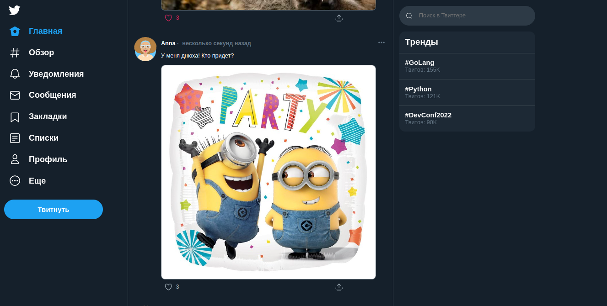

# Twitter clone V-0.0.1

___

### Корпоративный сервис микроблогов, аналог twitter для использования внутри компании.

***

### Функциональные требования.

1. Пользователь может добавить новый твит.
2. Пользователь может удалить свой твит.
3. Пользователь может зафоловить другого пользователя.
4. Пользователь может отписаться от другого пользователя.
5. Пользователь может отмечать твит как понравившийся.
6. Пользователь может убрать отметку «Нравится».
7. Пользователь может получить ленту из твитов отсортированных в
порядке убывания по популярности от пользователей, которых он
фоловит.
8. Твит может содержать картинку.

Заметим, что требования регистрации пользователя нет: это корпоративная сеть и пользователи будут создаваться не нами. Но нам нужно уметь отличать одного пользователя от другого. Об этом поговорим чуть позже. Также систему описывают через список нефункциональных требований, то
есть список того, как система должна выполнять функциональные
требования.

***

### Нефункциональные требования.

***

1. Систему должно быть просто развернуть через Docker Compose.
2. Система не должна терять данные пользователя между запусками.
3. Все ответы сервиса должны быть задокументированы через Swagger.


***
### Внешний вид.



***

### Важно.

Для запуска у вас должен быть установлен Docker.
Так же перед запуском необходимо настроить переменные окружения в файле **.env**, изменив значения

**DB_USER**=<your_db_user>

 **DB_PASS**=<your_db_pass>

**DB_NAME**=<your_db_name>

### Подготовка окружения.

Для корректного запуска приложения, а также, чтобы запускать тесты, 
нам нужно создать виртуальное окружение и установить зависимости.

```python3 -m venv venv```

```source venv/bin/activate```

```pip install -r requirements.txt```


### Запуск приложения.

Из директории с файлом docker-compose.yaml запустить сборку 
контейнеров командой docker compose up и дождаться окончания сборки. Это займет некоторое время.

```docker compose up```

После окончания сборки перейти в директорию _app_ -> alembic -> versions, и удалить из этой директории все файлы. Затем выполнить команды 

`alembic revision --autogenerate -m "create tables"`

`alembic upgrade head`

Должны выполниться миграции и создаться таблицы базы данных для работы приложения.
Чтобы минимально проверить работоспособность приложения необходимо создать в таблице users
пользователя с api_key - 'test'.

Приложение готово к работе. Перейдите по адресу:

```http://127.0.0.1/```  если тестируете на локальной машине.


По умолчанию, чтобы легче было проверить работоспособность приложения, мы показываем все 
твиты отсортированные по количеству лайков, в файле **config.py** можно изменить 
на показ твитов только от тех пользователей на которых текущий пользователь подписан, поставив
**tweet_followers** в значение True.

### Запуск тестов.

Запуск тестов производить из директории **app** командой:

```python -m pytest -v tests```

___

PS.

На данный момент, приложение носит достаточно скромный функционал, просьба отнестись с пониманием.
Мы работаем над развитием приложения, если вас заинтересовал проект - присоединяйтесь к нам!
___
